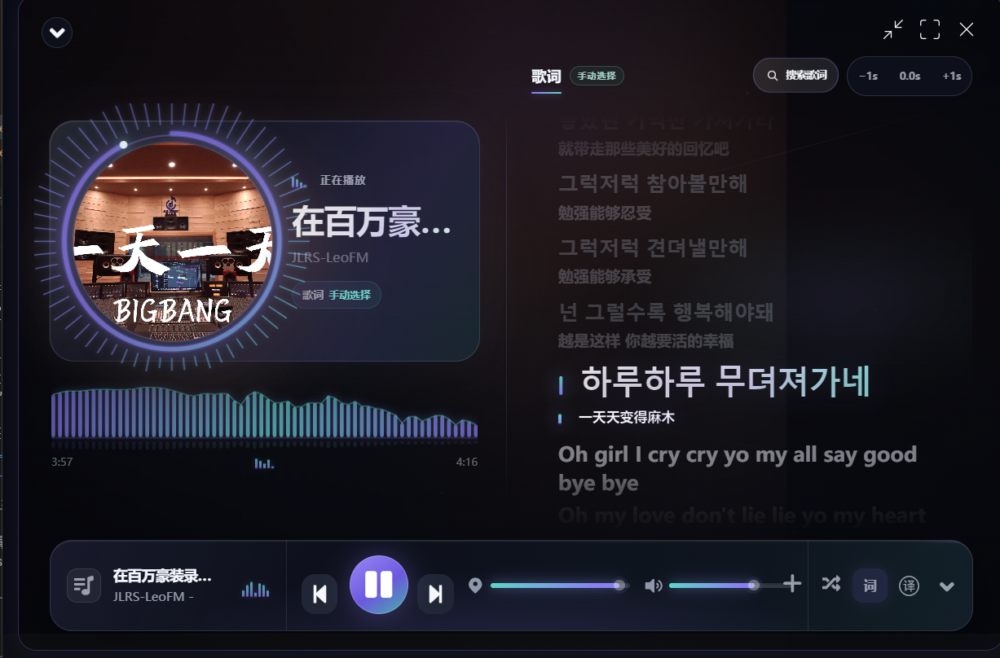
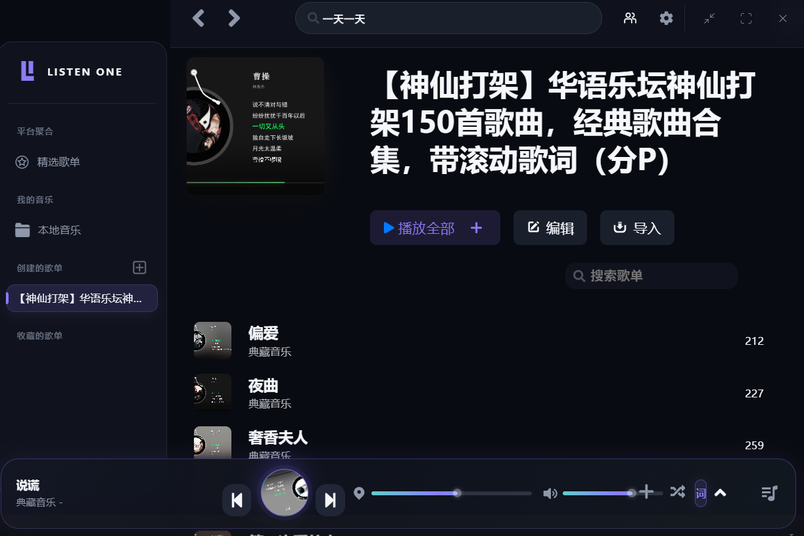

<div align="center">

# Listen2

### 把 Bilibili 上的优质音乐，整理成真正好用的桌面播放器

不再为了基础播放、歌词、翻译和舒服的桌面界面，额外购买一套音乐会员服务。

[](./LICENSE.md)
[](https://www.electronjs.org/)
[](#平台支持)
[](#平台支持)
[](https://github.com/listen1/listen1)

</div>

> Listen2 是 [Listen1](https://github.com/listen1/listen1) 的社区增强版本。它保留了 Listen1 的聚合播放与歌单能力，把 Bilibili 上用户可正常访问的音乐内容整理成更完整的桌面体验：搜索、播放、歌单、同步歌词、翻译、扫码登录、MV 和现代化 UI。

## 界面预览





> 更多实际播放效果和操作演示可通过项目的 Bilibili 视频查看。

<!-- SCREENSHOTS:START
<p align="center">
  
</p>

<table>
  <tr>
    <td width="50%"></td>
    <td width="50%"></td>
  </tr>
  <tr>
    <td align="center">音乐库与新版播放栏</td>
    <td align="center">现代白主题</td>
  </tr>
  <tr>
    <td width="50%"></td>
    <td width="50%"></td>
  </tr>
  <tr>
    <td align="center">歌词搜索与手动匹配</td>
    <td align="center">桌面双语歌词</td>
  </tr>
</table>
SCREENSHOTS:END -->

## 为什么做这个版本

Listen1 是一个很有价值的开源项目，但随着音乐平台接口与版权策略不断变化，一些旧接口已经不再稳定。与此同时，Bilibili 上仍有大量现场、翻唱、音乐区作品和独立创作者内容，却经常存在标题信息复杂、没有内嵌歌词、封面比例不统一等问题。

这个项目最直接的出发点也很简单：我不希望只是为了获得完整的播放、歌词、翻译和桌面 UI，再去开一个音乐会员。Bilibili 上已经存在大量用户可以正常访问的优秀音乐资源；如果能把歌曲信息整理好、把歌词与翻译补齐，再配上一套真正适合日常使用的界面，体验就已经非常完整。

Listen2 做的是整理和改善这些可访问内容的播放体验，而不是解锁用户原本无权访问的资源。当前版本集中完成了五件事：

1. 让桌面播放器更现代、更有沉浸感。
2. 让 Bilibili 内容更容易搜索、识别和播放。
3. 在视频没有歌词时，尽可能准确地补全同步歌词。
4. 优先寻找现成译文；仍无译文时，由用户决定是否使用 DeepSeek 翻译整首歌词。
5. 在账号实际权限范围内提供 Bilibili 扫码登录、可用音质选择和 MV 播放。

## 主要改动

### 全新的现代播放器

- 新增“现代黑”和“现代白”两套主题，统一音乐库、播放详情页、弹窗与底部播放栏。
- 重做沉浸式播放详情页：圆形封面、环形播放进度、背景氛围光与分层信息布局。
- 重做播放栏、音量滑杆、进度反馈和交互状态，使高频操作更清晰。
- 使用真实音频分析驱动频谱与环形动态效果；动画响应当前歌曲，而不是随机播放预设动画。
- 保留必要的动效层次，同时避免封面反复缩放造成视觉干扰。

### 更完整的 Bilibili 音乐体验

- 更新 Bilibili 视频与音频相关接口适配。
- 支持从复杂的视频标题、分 P 信息与播放器元数据中提取更干净的歌曲线索。
- 针对“4K 修复”“无损”“MV”“动态歌词”等常见标题噪声进行清理，提高歌曲识别率。
- 改善 Bilibili 搜索、播放地址解析、封面与作者信息的展示。
- 当原视频没有歌词时，根据歌名、歌手、时长等信息进行高置信度匹配。

### Bilibili 扫码登录、音质与 MV

- 支持使用 Bilibili 客户端扫码登录，二维码在本地生成，不向第三方二维码服务发送登录地址。
- 登录 Cookie 保存在 Electron 会话中，刷新令牌使用系统安全存储加密；退出时同时处理服务端会话与本地数据。
- 登录只会使用账号和当前视频实际返回的音质与画质，不解锁会员、付费、地区限制或其他无权访问的内容。
- 支持在当前 Bilibili 视频的纯音频与 MV 之间切换；MV 使用静音视频轨，现有音频播放器继续作为唯一声音和同步时钟。
- 支持分 P、实际可用画质选择和全屏播放；视频流不可用时会保留纯音频播放。

### 更稳健的播放恢复

- Bilibili 音频会按顺序尝试可用的备用 CDN 地址，并在地址过期或临时网络异常时有界刷新媒体信息。
- 播放卡顿、媒体节点异常和音频输出中断会进入限次数恢复流程，同时尽量保留当前播放位置。
- 区分临时网络故障、超时与明确的权限或内容错误，避免把普通网络波动统一提示为“版权问题”并连续快速切歌。
- 恢复次数耗尽后会停止自动尝试并给出明确错误，不会无限循环重建播放器或切换歌曲。

### 歌词、翻译与手动匹配

- 支持同步歌词、播放偏移校正和当前行高亮。
- 支持原文与翻译按各自时间轴同步显示，播放页与桌面歌词可分别开启翻译。
- 为 Bilibili 内容增加多来源歌词候选，并通过标题、歌手和时长综合评分，避免仅凭模糊歌名直接套用错误歌词。
- 搜索歌词时会标记哪些候选包含译文；当前来源没有译文时，会继续从其他高匹配歌词源寻找。
- 所有歌词源都没有译文时，用户可主动选择 DeepSeek 整首翻译。默认目标语言是简体中文，提示词要求译文忠实原意，同时尽量保留意象、语气与歌词的美感。
- Listen2 不会在播放、切歌或加载歌词时自动调用 DeepSeek。只有用户在确认面板中点击“使用 DeepSeek 翻译整首歌词”后，才会将歌名、歌手和整首歌词发送给 DeepSeek；该请求可能产生 API 费用。
- 程序将整首歌词作为一个请求，再按原始时间戳逐行回填，不会逐句调用 API。
- 翻译行数或行号无法完整对应时，会丢弃整次机器翻译结果，避免错行；成功结果会缓存，减少重复请求与费用。
- DeepSeek API 密钥通过 Electron 安全存储加密保存，不会返回给播放器页面。
- 自动匹配不可靠时，可以搜索候选并由用户手动选择；选择结果会针对当前曲目保存。
- 对没有逐词时间戳的歌词只做可靠的逐行高亮，不伪造逐词卡拉 OK 进度。

> 翻译顺序固定为：当前歌词自带译文 → 其他高匹配歌词源的译文 → 用户明确确认的 DeepSeek 整首翻译。Listen2 不会把不相关文本或无法可靠对齐的结果当作歌词展示。

### 更可靠的随机播放

- 使用 Fisher–Yates 洗牌生成每轮随机队列。
- 一轮内每首可播放歌曲只出现一次，切换到下一轮时避免立刻重复上一首。
- 每次重新进入随机播放或替换歌单都会生成新顺序。
- “上一首”沿真实播放历史返回，不会再次随机跳转。

### 桌面歌词

- 支持桌面歌词置顶、拖动、透明度、字号与颜色调节。
- 未锁定时提供上一首、播放/暂停和下一首快捷控制，并同步显示真实播放状态。
- 锁定后歌词区域保持点击穿透，只保留明确的解锁入口。
- 支持原文与翻译同时显示。
- macOS 下针对多桌面空间、全屏应用和原生窗口按钮做了单独处理。

## 当前状态

- Bilibili 搜索、分 P 解析、音频播放和歌曲线索提取已经可用。
- Bilibili 扫码登录、会话保存与退出、实际音质选择已经接入。
- Bilibili 视频轨 MV、画质选择、全屏和纯音频降级已经完成核心实现。
- 多 CDN 候选、媒体信息刷新、播放卡顿与输出中断的有界恢复已经接入并覆盖自动化测试。
- 现代黑/白主题、沉浸式播放页、实时频谱和新版播放栏已经完成。
- 自动歌词匹配、手动搜索、跨来源译文和用户确认后的 DeepSeek 整首翻译已经接通。
- Windows 11 x64 安装包已经完成架构与打包内容核验；macOS Universal DMG 已完成构建、双架构与挂载核验。

## 验证边界与后续改进

- 扫码登录与 MV 已完成核心实现和自动化测试，但仍需要在更多普通账号、大会员账号、地区和视频样本上持续实机验证。
- 不同 Mac 与 Windows 设备对 AVC、HEVC、AV1 的支持不同；画质菜单只展示运行时实际返回且设备可用的候选。
- Bilibili Web 接口和 CDN 行为可能变化，后续仍需持续维护登录、媒体清单与播放降级逻辑。
- 当前只为 Bilibili 来源的歌曲直接提供 MV；其他来源不会自动猜测视频，避免绑定错误内容。
- macOS 安装包目前未使用 Apple Developer ID 签名或公证，首次打开时可能出现系统安全提示。

## 与原版 Listen1 的关系

| 项目      | Listen1 原版               | Listen2                                           |
| --------- | -------------------------- | ------------------------------------------------- |
| 核心能力  | 多平台聚合搜索、播放和歌单 | 完整保留                                          |
| 界面      | 经典桌面布局与主题         | 新增现代黑/白与沉浸式播放页                       |
| Bilibili  | 基础搜索与播放             | 更新接口、清理标题、补充元数据、多 CDN 与有界恢复 |
| 账号与 MV | 无                         | 本地扫码、权限内音质、分 P MV、画质选择与全屏     |
| 动态效果  | 基础播放反馈               | 真实音频驱动的频谱和环形视觉                      |
| 歌词      | 依赖来源直接返回           | 自动匹配、跨源译文、整首机器翻译、双语时间轴      |
| 随机播放  | 传统随机跳转               | 无重复洗牌队列与播放历史                          |
| 桌面歌词  | 基础悬浮窗口               | 播放控制、锁定穿透、双语显示与 macOS 窗口优化     |

本仓库保留上游提交历史与 MIT 许可证，方便追溯来源。后续若条件允许，也欢迎将通用修复反馈给上游项目。

## 平台支持

核心播放器界面、Bilibili 适配、实时频谱和歌词逻辑由 macOS、Windows、Linux 共用。

| 平台                        | 当前状态         | 说明                                                                                |
| --------------------------- | ---------------- | ----------------------------------------------------------------------------------- |
| macOS Intel / Apple Silicon | 已构建并核验     | Universal DMG 已验证包含 x86_64 与 arm64，当前未签名或公证                          |
| Windows x64                 | 已构建并实机核验 | 已生成 NSIS 安装包；核心 UI、歌词搜索、跨源翻译与整首机器翻译功能已进入最终打包产物 |
| Windows ia32 / arm64        | 保留构建能力     | 当前没有对应设备的实机回归                                                          |
| Linux                       | 保留上游构建能力 | 不是当前版本的主要测试平台                                                          |

Windows 与 macOS 会看到相同的现代主题、播放详情、频谱、歌词搜索和双语歌词。两者不会完全相同的部分是窗口标题栏、多桌面空间以及桌面歌词置顶等操作系统原生行为。

## 开始使用

### 环境要求

- Node.js 18 或更高版本
- npm
- macOS、Windows 或 Linux 桌面系统

### 本地运行

```bash
git clone https://github.com/dazzlingwuming/listen2.git
cd listen2
npm ci
npm run dev
```

本仓库已将修改后的前端代码直接放在 `app/listen1_chrome_extension` 中，不需要再初始化 Git 子模块。

### 作为 Chrome 扩展调试界面

不生成桌面客户端也可以预览和调试大部分前端页面：

1. 打开 Chrome 的 `chrome://extensions/`。
2. 开启“开发者模式”。
3. 选择“加载已解压的扩展程序”。
4. 选择 `app/listen1_chrome_extension` 目录。
5. 修改前端后，在扩展管理页点击“重新加载”。

桌面歌词、窗口置顶、系统托盘等 Electron 原生功能仍需运行桌面客户端。

## 构建安装包

```bash
# macOS：按当前配置生成 x64、arm64 和 Universal DMG
npm run dist:mac

# Windows：生成 NSIS 安装包和 7z 包
npm run dist:win

# Linux
npm run dist:linux
```

构建产物位于 `dist/`。公开分发前建议在目标系统实机测试，并按各平台要求完成代码签名。

## 项目结构

```text
listen2/
├── app/
│   ├── main.js                    # Electron 主进程与桌面窗口
│   ├── floatingWindow.html        # 桌面歌词窗口
│   └── listen1_chrome_extension/  # 共用播放器前端与音乐平台适配
├── build/                          # 应用图标与打包资源
├── docs/screenshots/               # README 截图
├── 图片/                            # 当前版本界面预览
├── package.json                    # 开发与打包脚本
└── README.md
```

## 已知限制

- 音乐平台和歌词接口可能随时调整，无法保证所有来源永久可用。
- Bilibili 登录、播放地址和 MV 使用其 Web 端内部接口，并非承诺长期稳定的公开 API；接口变化时可能需要重新适配。
- Bilibili 视频标题并不总是包含规范歌名和歌手；自动匹配坚持较高阈值，遇到不确定结果时请使用手动歌词搜索。
- 登录只使用账号实际拥有的访问权限，不保证获得某个固定音质或画质，也不会绕过会员、付费、DRM 或地区限制。
- MV 可用性受视频本身、地区、CDN 和设备编解码能力影响；不可用时继续使用纯音频模式。
- 逐词高亮需要来源提供逐词时间戳。普通 LRC 只能可靠地做到逐行同步。
- 机器翻译是所有歌词源均无译文时的可选能力，仅桌面客户端支持；需要用户自行配置 DeepSeek API 密钥并确认每首歌的首次翻译请求。
- Windows 和 Linux 的安装包建议由对应系统构建和验证。

## 贡献

欢迎提交 Issue 或 Pull Request，尤其欢迎以下方向：

- Bilibili 接口兼容与歌曲元数据识别
- Bilibili 视频 MV、音画同步、编解码兼容与 CDN 实机反馈
- Bilibili 扫码登录、Cookie 续期、音质选择与安全退出的实机反馈
- Windows / Linux 桌面歌词实机反馈
- 歌词匹配准确率与多语言翻译
- 无障碍、键盘操作与性能优化

提交问题时，请尽量附上系统版本、复现步骤、内容来源链接和日志；请勿上传受版权保护的音频文件。

## 开源许可与致谢

本项目基于以下开源项目继续开发：

- [listen1/listen1](https://github.com/listen1/listen1)
- [listen1/listen1_desktop](https://github.com/listen1/listen1_desktop)
- [listen1/listen1_chrome_extension](https://github.com/listen1/listen1_chrome_extension)

项目继续使用 [MIT License](./LICENSE.md)。原始版权声明保留在许可证与相关源文件中。

感谢 Listen1 的作者和所有贡献者建立了这个项目的基础。

## 免责声明

Listen2 本身免费、开源，不托管、不上传、不销售任何音乐或歌词内容，也不提供绕过付费、DRM 或平台访问控制的功能。搜索结果、音频、封面和歌词来自相应第三方平台，相关权利归原权利人所有。

使用者应遵守所在地法律法规、内容版权要求以及第三方平台的服务条款。本项目仅供学习、研究与个人使用；若某项内容不应被访问或展示，请通过 Issue 提供必要信息。
