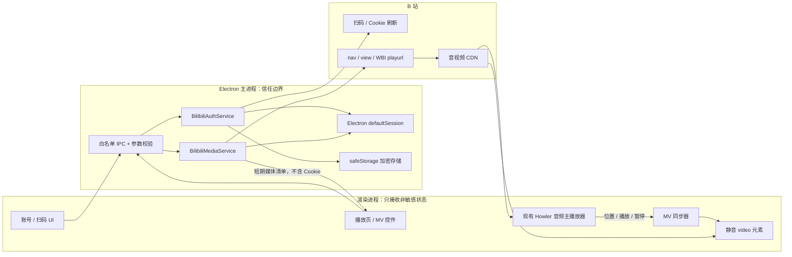
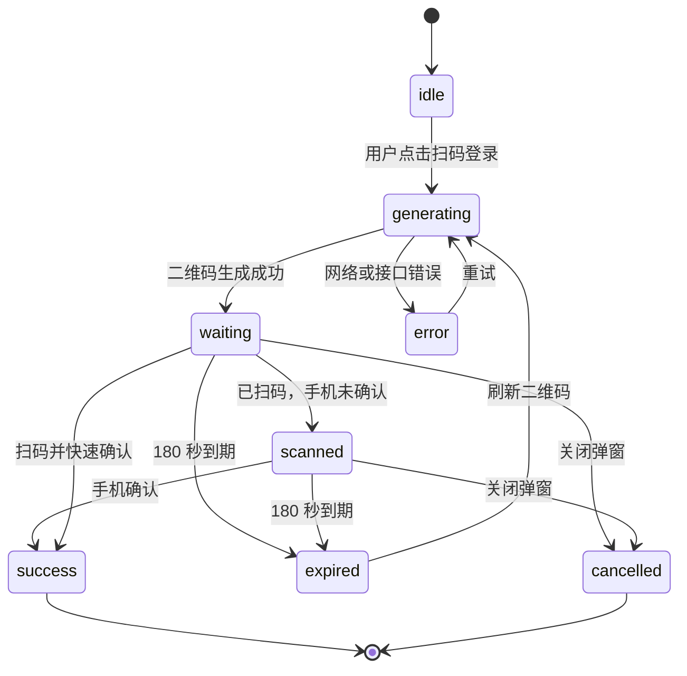

# Listen2：B 站扫码登录、高清音频与 MV 实施规划

> 文档状态：核心 MVP 已实现，Windows x64 NSIS 安装包已构建
>
> 调研日期：2026-07-25
>
> 适用项目：Listen2 Electron 2.33.0
> 本文同时记录实施边界、设计依据与当前完成度。

## 当前实现状态（2026-07-25）

已完成：主进程 B 站适配层、二维码扫码状态机、Electron 默认会话 Cookie 持久化、`safeStorage` 加密保存刷新令牌、限频 Cookie 检查/刷新/确认、WBI DASH 清单、实际可播放音质选择、单一全窗口静音 MV 与 Howler 时钟同步、画质选择、全屏、退出清理及单元测试。

已构建：Windows x64 NSIS 安装包 `dist/listen1_2.33.0_win_x64.exe`。安装包中的 `app.asar` 已核验包含 B 站服务、二维码、MV 与播放器改动；构建只产出 x64 NSIS，不包含 ia32、ARM64 或便携包。

待人工验收：使用真实普通账号和大会员账号分别扫码；确认扫码后重启仍保持登录；确认目标 Windows 电脑的 AVC/HEVC/AV1 支持；验证特定 CDN 视频流能否直接由 `<video>` 播放；完成一次安装、卸载与权限提示检查。

## 1. 结论先行

这项功能可以实现，获取 B 站音频和视频的核心流程也确实相近：

1. 用 `bvid` 查询视频信息，得到具体分 P 的 `cid`。
2. 在登录会话中生成 WBI 签名。
3. 请求播放地址接口，取得 DASH 视频流与音频流。
4. 根据账号实际返回的清晰度、浏览器支持的编码和用户设置选择流。
5. 将现有 Howler 音频作为唯一声音和主时钟，再同步播放一个静音的视频流。

真正需要认真处理的不是“拿到一个 URL”，而是以下五件事：

- 扫码登录后的 Cookie 安全保存、续期与退出；
- B 站内部 Web 接口可能变化，必须做适配层和降级；
- DASH 的音频、视频是分离的，不能把它误当成一个普通 MP4；
- 播放地址会过期，不能持久化，也不能只取数组第一项；
- Windows 上 AVC、HEVC、AV1、FLAC 等编码支持不同，必须运行时检测。

本项目推荐的第一版不是再建立一套完整音视频播放器，而是：

> **继续让 Listen2 当前的 Howler 音频播放器负责声音、进度、音量和歌词；MV 只播放 B 站返回的静音视频轨，并持续向音频时钟对齐。**

这样做对现有功能侵入最小，切换“封面 / 歌词 / MV”时歌曲不会重头播放，也不会出现两份声音。

## 2. 项目当前状态与问题

### 2.1 已有能力

当前代码已经具备不少可复用基础：

- `provider/bilibili.js` 已能根据 `bvid` 获取视频详情与 `cid`；
- 视频音轨 ID 已采用 `bitrack_v_${bvid}-${cid}`，可以稳定定位具体分 P；
- 已有 WBI Key 获取、混淆与签名函数；
- `player_thread.js` 中 Howler 是现有主播放器；
- 播放线程每秒发送约 10 次 `BG_PLAYER:FRAME_UPDATE`，足以用来做 MV 同步；
- `main.js` 已为 `bilibili.com`、`bilivideo.com` 和 `bilivideo.cn` 设置 Referer/CORS 相关网络处理；
- Electron 的默认会话已经用于当前页面和媒体请求，适合继续承载 B 站 Cookie。

### 2.2 必须修复的现状

当前 B 站播放逻辑存在几个直接问题：

- `loweb.js` 中 B 站的 `support_login` 仍为 `false`；
- `bootstrap_track()` 使用旧的非加密 `http://api.bilibili.com/x/player/playurl`；
- 当前代码直接选择 `dash.audio[0]`，但 B 站不保证数组第一项就是最高音质；
- 当前没有用户信息、扫码登录、Cookie 续期和退出登录实现；
- 没有视频流选择、编解码兼容判断、过期刷新和备用 URL 切换；
- Electron 主窗口仍启用了 `nodeIntegration`、`enableRemoteModule`，并关闭了
  `contextIsolation`，不应在这个窗口里加载任何远程登录网页或远程脚本。

因此，“加一个 `<video>` 标签”只能做演示，不能作为可发布版本。

## 3. 范围

### 3.1 第一版必须完成

- B 站二维码扫码登录；
- 登录 Cookie 持久化，应用重启后在 Cookie 有效期内免重复扫码；
- 登录状态、头像、昵称、会员状态展示；
- Cookie 需要续期时自动刷新；
- 完整退出：服务端退出、清除本地 Cookie、清除刷新令牌；
- B 站视频轨的实际音质和画质列表获取；
- 修复当前默认音频流选择；
- B 站视频轨的 MV 播放；
- 音频 / MV 无缝切换，不重播、不重复发声；
- 画质选择、全屏、加载态、错误态和音频模式降级；
- Windows x64 安装包中的真实账户验收。

### 3.2 第一版明确不做

- 不破解、不伪造会员权限，不请求账号无权使用的清晰度；
- 不下载、缓存或导出完整 B 站音视频文件；
- 不做弹幕、评论、投币、点赞、收藏和观看历史上报；
- 不承诺 HDR、杜比视界、8K、杜比全景声或 Hi-Res 在所有电脑可用；
- 不自动为所有非 B 站歌曲猜测并绑定 MV；
- 不在本地保存长期有效的播放 URL；
- 不把 B 站 Cookie、CSRF 或刷新令牌发送给渲染进程；
- 不把开源 GPL 项目的代码复制进本 MIT 项目。

### 3.3 后续版本

- 对非 B 站歌曲按“歌名 + 歌手”搜索候选 MV；
- 用户手动确认并保存歌曲与 `bvid/cid` 的绑定；
- 弹幕；
- 外部播放器或 MPV 后端；
- 电视投屏；
- 观看历史心跳；
- 针对 HDR、杜比、Hi-Res 的设备能力与账号能力矩阵。

## 4. 合规边界

### 4.1 官方接口与内部 Web 接口的区别

B 站开放平台提供账号授权、用户管理和内容管理等公开能力，但目前公开文档中没有覆盖
Listen2 所需的普通站内视频播放流接口。因此：

1. 面向长期公开发布时，优先申请并评估 B 站开放平台是否能提供正式授权方案；
2. 扫码登录、WBI 播放地址等实现目前需要使用 B 站网页自身使用的内部接口；
3. 内部接口是社区逆向记录，不是稳定的公开 API，随时可能改变；
4. 所有调用必须经过单独的 `BilibiliAdapter`，不能散落在 UI 与播放器代码中；
5. 应提供功能开关，以便接口失效或政策变化时只关闭 B 站登录/MV，而不影响本地音乐和其他平台。

### 4.2 账号权限

扫码登录的意义是让请求使用用户自己的 B 站会话。它可能让接口返回该用户有权访问的更高音质或画质，但：

- 登录不等于大会员；
- 大会员也不保证每个视频都存在全部清晰度；
- 地区、版权、投稿源质量和设备编码能力仍会限制可用流；
- UI 必须写“登录后可使用账号有权访问的画质”，不能写“登录即可解锁 4K”；
- 客户端只展示接口实际返回的流，不构造或猜测未返回的地址。

### 4.3 隐私

Cookie 和刷新令牌属于敏感登录信息。实现必须满足：

- 仅用于 B 站账号状态和用户主动播放的 B 站资源；
- 默认不上传到 Listen2 服务、日志、崩溃报告或代码仓库；
- 设置页明确说明保存位置、用途和退出清理方式；
- 退出登录时同时执行服务端退出与本地彻底清理；
- 调试日志只能记录 Cookie 名称，绝不能记录 Cookie 值。

参考：

- [B 站开放平台](https://open.bilibili.com/doc)
- [哔哩哔哩隐私政策](https://www.bilibili.com/blackboard/privacy-policy.html)
- [哔哩哔哩用户使用协议](https://www.bilibili.com/blackboard/user-rule-linux.html?night=1&padding=0)

## 5. 已验证的接口事实

下表中的 B 站 Web 接口来自社区维护的接口资料，属于非官方内部接口。

| 用途                   | 方法与地址                                                                | 鉴权                       | 实施注意事项                                       |
| ---------------------- | ------------------------------------------------------------------------- | -------------------------- | -------------------------------------------------- |
| 生成二维码             | `GET https://passport.bilibili.com/x/passport-login/web/qrcode/generate`  | 无                         | 返回二维码 URL、`qrcode_key`，约 180 秒过期        |
| 轮询扫码状态           | `GET https://passport.bilibili.com/x/passport-login/web/qrcode/poll`      | `qrcode_key`               | 主进程轮询，成功响应包含 Cookie 与 `refresh_token` |
| 查询登录用户           | `GET https://api.bilibili.com/x/web-interface/nav`                        | Cookie                     | 返回登录状态、昵称、头像、VIP 与 WBI Key           |
| 检查 Cookie 是否需刷新 | `GET https://passport.bilibili.com/x/passport-login/web/cookie/info`      | Cookie + CSRF              | 不要等播放失败才处理                               |
| 刷新 Cookie            | `POST https://passport.bilibili.com/x/passport-login/web/cookie/refresh`  | 旧 Cookie、CSRF、刷新令牌  | 刷新成功后还要确认旧令牌                           |
| 确认刷新               | `POST https://passport.bilibili.com/x/passport-login/web/confirm/refresh` | 新 Cookie、旧刷新令牌      | 确认后再删除旧令牌                                 |
| 退出登录               | `POST https://passport.bilibili.com/login/exit/v2`                        | Cookie + `biliCSRF`        | 成功后继续清除本地会话                             |
| 获取视频信息           | `GET https://api.bilibili.com/x/web-interface/view`                       | 可匿名                     | 用 `bvid` 获取 `cid`、时长、分 P                   |
| 获取播放流             | `GET https://api.bilibili.com/x/player/wbi/playurl`                       | WBI，Cookie 可提升账号权限 | 请求 `fnval=4048` 获取 DASH 视频和音频             |

2026-07-25 对公开样本 `BV1y7411Q7Eq / cid 171776208` 做过匿名只读验证：

- 接口可返回分离的 `dash.video` 和 `dash.audio`；
- `accept_quality` 宣称的档位多于实际返回的 `dash.video`；
- 当时实际视频流只有 360P 与 480P，但音频数组包含多个不同档位；
- 同一画质可能同时出现 AVC、HEVC、AV1 编码。

这验证了两个实现原则：

1. **清晰度菜单必须来自实际返回的 `dash.video`，不能直接使用 `accept_quality`。**
2. **默认音频不能使用 `dash.audio[0]`，必须按格式、档位、带宽与设备能力选择。**

社区接口资料：

- [扫码登录](https://github.com/bilibili-plugins/bilibili-api-collect/blob/master/docs/login/login_action/QR.md)
- [Cookie 刷新](https://github.com/bilibili-plugins/bilibili-api-collect/blob/master/docs/login/cookie_refresh.md)
- [退出登录](https://github.com/bilibili-plugins/bilibili-api-collect/blob/master/docs/login/exit.md)
- [登录用户信息](https://github.com/bilibili-plugins/bilibili-api-collect/blob/master/docs/login/login_info.md)
- [视频流 URL](https://github.com/bilibili-plugins/bilibili-api-collect/blob/master/docs/video/videostream_url.md)

## 6. 总体架构



### 6.1 为什么放在主进程

登录与播放流请求必须放在 Electron 主进程，原因是：

- Cookie 和刷新令牌不需要暴露给页面脚本；
- 可以统一使用 Electron 会话；
- 可以集中处理 WBI、Cookie 续期、限流、过期和错误码；
- 可以对 IPC 调用来源、参数和返回字段做白名单控制；
- 后续 B 站接口变化时只修改适配层。

### 6.2 为什么先使用 `defaultSession`

当前 Listen2 页面、现有 B 站请求和媒体加载都使用默认会话。第一版继续使用
`session.defaultSession`，可以避免：

- 登录 Cookie 存在一个分区，而播放请求落在另一个分区；
- CDN 请求、Referer 处理与当前播放器失去一致性；
- 为独立分区再实现代理或自定义协议。

如果以后把 B 站网络全部收口到主进程代理，再考虑使用
`persist:listen2-bilibili` 的独立持久分区。

## 7. 扫码登录设计

### 7.1 状态机



轮询状态码：

| `data.code` | 含义           | UI                         |
| ----------- | -------------- | -------------------------- |
| `86101`     | 未扫码         | “请使用哔哩哔哩客户端扫码” |
| `86090`     | 已扫码、未确认 | “已扫码，请在手机上确认”   |
| `86038`     | 二维码过期     | 停止轮询并显示“刷新二维码” |
| `0`         | 登录成功       | 验证 Cookie 后关闭二维码   |

### 7.2 具体流程

1. 渲染进程调用 `beginQrLogin()`。
2. 主进程生成本地随机 `sessionId`，向 B 站请求二维码。
3. `qrcode_key` 只保留在主进程内存中。
4. 主进程将二维码内容或本地生成的二维码 Data URL、过期时间返回给 UI。
5. 主进程每 1 ～ 1.5 秒轮询一次，同一时刻只允许存在一个扫码任务。
6. 用户关闭弹窗、窗口销毁、二维码过期时，使用 `AbortController` 立即取消。
7. 成功后由绑定 `defaultSession` 的 Electron 网络请求接收 `Set-Cookie`。
8. 如果当前 Electron 网络 API 未自动落盘，则从响应头逐个调用
   `session.cookies.set()`；不在渲染进程解析 Cookie。
9. 检查必需 Cookie 是否存在，再调用 `session.cookies.flushStore()`。
10. 加密保存 `refresh_token`。
11. 调用 `/x/web-interface/nav` 验证 `isLogin`，只把公开账号资料发给 UI。

二维码图片建议使用 MIT 许可的 `qrcode` 包在本地生成。不要把 B 站登录网页嵌入当前
Node-enabled 主窗口。

### 7.3 Cookie

登录成功时常见 Cookie 包括：

- `DedeUserID`
- `DedeUserID__ckMd5`
- `SESSDATA`
- `bili_jct`
- `sid`

实现不能假设每次响应都具有完全相同的顺序或 Domain 写法。验收以
`nav.data.isLogin === true` 为最终标准，而不是“拿到了某个 Cookie”。

### 7.4 应用启动

```text
应用启动
  └─ 读取 defaultSession 中的 B 站 Cookie
      ├─ 没有 Cookie → 匿名状态
      └─ 有 Cookie → 请求 nav
          ├─ isLogin = true → 展示用户资料
          │   └─ 当日首次使用时检查是否需要刷新
          └─ isLogin = false → 清理失效状态，提示重新扫码
```

“扫码一次免登录”的准确含义是：**Cookie 仍有效时，应用重启不必再次扫码**。Cookie 被
B 站吊销、过期、用户修改密码或风控时，仍需要重新扫码。

## 8. Cookie 刷新与退出

### 8.1 刷新令牌保存

- B 站 Cookie：由 Electron 持久会话 Cookie Store 保存；
- `refresh_token`：使用 Electron `safeStorage` 加密后保存在
  `app.getPath('userData')` 下；
- 公开资料缓存：`mid`、昵称、头像 URL、VIP 状态可以明文保存；
- 不使用 `localStorage` 保存 Cookie、`bili_jct` 或刷新令牌；
- Windows 上 `safeStorage` 使用系统的数据保护能力；写入前检查
  `safeStorage.isEncryptionAvailable()`；
- 如果安全存储不可用，应要求用户重新登录或禁用持久登录，不能悄悄退化成明文。

### 8.2 刷新流程

1. 使用 `bili_jct` 请求 Cookie 刷新检查接口。
2. 若 `refresh === false`，更新本地检查时间并结束。
3. 若需要刷新，按接口要求生成 RSA-OAEP 对应路径并取得 `refresh_csrf`。
4. 使用旧 Cookie、旧刷新令牌和 CSRF 请求刷新。
5. 验证新 Cookie 与新刷新令牌。
6. 使用旧刷新令牌调用确认刷新接口。
7. 只有确认成功后，才用新刷新令牌覆盖旧令牌。
8. 任一步失败都保留可恢复状态，禁止把唯一可用的旧令牌提前删除。

触发时机：

- 应用启动后首次使用 B 站能力；
- 每 24 小时最多主动检查一次；
- `nav` 表明未登录时不无限重试；
- 播放流返回明确登录失效错误时，检查一次后提示用户；
- 对 412、429 等风控/限流错误指数退避，禁止紧密循环。

### 8.3 退出

1. 使用当前 `bili_jct` 调用 B 站退出接口；
2. 无论服务端退出是否成功，都允许用户继续执行本地清理；
3. 枚举并删除 B 站相关 Domain 下的认证 Cookie；
4. 清除加密刷新令牌与公开资料缓存；
5. 清除 WBI Key、媒体清单与短期播放 URL；
6. 广播匿名账号状态；
7. 已播放的本地或其他来源音乐不受影响；当前 B 站流无法继续时降级为停止/重新获取匿名流。

## 9. B 站音频和视频如何获取

### 9.1 输入

第一版 MV 只对 B 站视频轨开放。当前 ID 已包含足够信息：

```text
bitrack_v_${bvid}-${cid}
```

如果只有 `bvid`：

```http
GET https://api.bilibili.com/x/web-interface/view?bvid={bvid}
```

从 `data.pages[]` 选择正确分 P 并取得 `cid`。多分 P 视频必须沿用当前歌曲对应的
`cid`，不能始终选择第一页。

### 9.2 获取 WBI Key

登录状态接口 `nav` 会返回 WBI 图片地址。现有 `bilibili.js` 已有 WBI 混淆与签名代码，
但后续播放接口由主进程负责，因此应将它抽成可测试的主进程模块，而不是让渲染进程继续
直接请求。

处理规则：

- 缓存当前 WBI Key，避免每首歌重复获取；
- 412、签名错误或 Key 变化时清除缓存并只重试一次；
- 签名输入使用明确字段白名单；
- 不把 Cookie 拼进 URL 或日志。

### 9.3 请求 DASH

推荐请求：

```http
GET https://api.bilibili.com/x/player/wbi/playurl
  ?bvid={bvid}
  &cid={cid}
  &qn=127
  &fnver=0
  &fnval=4048
  &fourk=1
  &wts={timestamp}
  &w_rid={signature}
```

`qn=127` 表达希望接口返回最高能力范围，不代表客户端一定能取得 8K。最终只能使用响应
实际给出的流。

典型 DASH 结果：

```text
dash
  ├─ video[]        普通视频流，通常同一清晰度有多种编码
  ├─ audio[]        普通音频流
  ├─ dolby.audio[]  杜比音频，可选
  └─ flac.audio     Hi-Res / FLAC，可选
```

视频和音频各有独立的 `baseUrl/base_url`、`backupUrl/backup_url`、MIME、编码、带宽和
分段索引。第一版播放时不下载或合并文件，而是分别流式加载。

### 9.4 播放地址生命周期

社区资料显示播放 URL 通常只有约两小时有效期。项目采用更保守的策略：

- 媒体清单内存缓存最多 90 分钟；
- 不写入 `localStorage`、数据库、播放列表或日志；
- 请求前检查本地 `expiresAt`；
- CDN 返回 403 或 URL 过期时重新请求一次媒体清单；
- 主 URL 失败后依次尝试 `backupUrl`；
- 412/429 不立即循环刷新；
- 切换账号、退出或切换分 P 时立即失效相关缓存。

## 10. 音质和画质选择

### 10.1 常见档位

常见视频质量 ID：

| ID  | 标签     |
| --- | -------- |
| 16  | 360P     |
| 32  | 480P     |
| 64  | 720P     |
| 74  | 720P60   |
| 80  | 1080P    |
| 112 | 1080P+   |
| 116 | 1080P60  |
| 120 | 4K       |
| 125 | HDR      |
| 126 | 杜比视界 |
| 127 | 8K       |

常见音频质量 ID：

| ID    | 一般含义      |
| ----- | ------------- |
| 30216 | 约 64K        |
| 30232 | 约 132K       |
| 30280 | 约 192K       |
| 30250 | 杜比音频      |
| 30251 | Hi-Res / FLAC |

这些数字只用于识别，实际标签还应结合响应的 `bandwidth`、`mimeType`、`codecs` 和特殊
字段。不要只按数组顺序判断。

### 10.2 视频选择算法

```text
实际 dash.video
  → 规范化 baseUrl / backupUrl / codec / 分辨率 / 帧率
  → 用 video.canPlayType() 过滤当前 Electron 无法播放的编码
  → 按用户设置的最高画质过滤
  → 同画质优先选择兼容性更好的 AVC
  → 用户明确开启且系统支持时，再优先 HEVC / AV1
  → 从实际候选中选择最高档
```

默认优先 AVC 是为了降低 Windows 电脑因 HEVC 扩展、显卡驱动或硬件解码差异导致的黑屏。
画质菜单只展示实际可播放候选，并可以在标签中显示 `AVC / HEVC / AV1`。

### 10.3 音频选择算法

```text
flac.audio + dolby.audio[] + dash.audio[]
  → 统一成 AudioVariant[]
  → 用 audio.canPlayType() 做能力检测
  → 按用户音质偏好与账号实际返回结果过滤
  → 同类型按质量 ID、带宽排序
  → 选择最高可播放项
```

默认建议：

- “自动”：优先最高可用的普通兼容音频；
- “高音质”：允许选择实际返回并可播放的 FLAC；
- 杜比作为后续能力，第一版不承诺；
- 选择结果必须在 UI 中显示真实标签；
- 如果高音质流失败，自动回落到下一条兼容音频且只提示一次。

这一步同时修复当前 `dash.audio[0]` 造成的潜在低音质问题。

## 11. MV 播放器设计

### 11.1 单一主时钟

Listen2 当前 Howler 音频继续作为唯一主播放器：

- 负责声音；
- 负责播放/暂停；
- 负责进度与拖动；
- 负责音量、静音；
- 负责上一首、下一首；
- 负责歌词同步；
- 负责媒体快捷键。

新增 `<video>`：

- `muted = true`；
- 只加载 B 站 DASH 视频轨；
- 不显示自身音量；
- 不单独保存进度；
- 永远跟随 Howler 状态；
- 出错时可以被移除而不打断音乐。

### 11.2 同步事件

复用现有播放器事件：

- `BG_PLAYER:LOAD`：更换歌曲或重新装载；
- `BG_PLAYER:PLAY_STATE`：播放、暂停；
- `BG_PLAYER:FRAME_UPDATE`：当前 Track ID、位置、时长和播放状态；
- 用户拖动进度；
- MV 画质切换；
- MV 打开/关闭。

打开 MV：

1. 确认当前 ID 是 `bitrack_v_`；
2. 获取或复用有效的媒体清单；
3. 选择视频流；
4. 设置 `video.muted = true`；
5. 等待 `loadedmetadata/canplay`；
6. 将 `video.currentTime` 对齐当前音频位置；
7. 音频正在播放时启动视频；
8. UI 进入全窗口 MV 接管层，只显示视频；歌词、封面、频谱和普通播放器界面不再渲染。

### 11.3 漂移校正

每次帧更新计算：

```text
drift = video.currentTime - audioPosition
```

建议阈值：

| 漂移绝对值             | 处理                                 |
| ---------------------- | ------------------------------------ |
| `< 120ms`              | 忽略，`playbackRate = 1`             |
| `120ms ～ 500ms`       | 短暂调整视频速率，例如 `0.97 / 1.03` |
| `> 500ms`              | 将视频硬跳到音频位置                 |
| 用户拖动、换歌、切画质 | 立即硬对齐                           |

视频只是画面，因此微调视频速度不会改变听感。稳定后恢复 `playbackRate = 1`。

### 11.4 音频 / MV 切换

- 打开 MV：不重建 Howler，不重新取音频，不修改歌曲进度；
- 关闭 MV：暂停并卸载视频流，Howler 继续播放；
- 切换画质：记录当前音频位置，重建视频源后对齐；
- 下一首不是 B 站视频：自动关闭 MV 或隐藏按钮；
- 视频加载失败：提示“MV 暂不可用，已继续音频播放”；
- 音频失败：按照现有播放器错误流程处理，不能让静音视频冒充成功。

### 11.5 直接播放与 MSE 降级

第一轮技术验证先尝试：

```html
<video muted playsinline src="video-only.m4s"></video>
```

如果 Electron/Chromium 对某些 B 站 `SegmentBase` 视频流不能稳定直接播放，则进入第二方案：

1. 用媒体清单生成内存中的 DASH MPD；
2. 使用 dash.js 或 Shaka Player；
3. 通过 Media Source Extensions 为视频创建 `SourceBuffer`；
4. 仍然不让该播放器输出音频。

是否引入 dash.js/Shaka 必须由 Windows、macOS 的真实兼容性试验决定，第一步不要提前增加
大型依赖。MSE 原理参考：
[MDN Media Source Extensions](https://developer.mozilla.org/en-US/docs/Web/API/Media_Source_Extensions_API)。

## 12. UI 方案

### 12.1 设置页：B 站账号卡片

匿名状态：

```text
┌──────────────────────────────────────────┐
│ 哔哩哔哩                                │
│ 扫码登录后，可使用账号有权访问的音质与画质 │
│                              [扫码登录]  │
└──────────────────────────────────────────┘
```

已登录状态：

```text
┌──────────────────────────────────────────┐
│ [头像] 昵称                    大会员/普通 │
│ 当前账号可用画质以每个视频实际返回为准     │
│                    [刷新状态] [退出登录]  │
└──────────────────────────────────────────┘
```

扫码弹窗：

- 二维码；
- 180 秒倒计时；
- 未扫码 / 已扫码待确认 / 已过期状态；
- 刷新二维码；
- 隐私提示；
- 关闭即取消轮询。

### 12.2 播放页

- 在当前“词 / 译”等播放控件附近加入 `MV`；
- 只对有确定 `bvid/cid` 的曲目启用；
- 打开后进入单一全窗口 MV 接管层，视频以 `contain` 方式完整显示；
- MV 模式不显示歌词、封面、频谱或普通播放器控件；鼠标悬停或键盘聚焦时才显示轻量的关闭、画质和全屏工具栏，`Esc` 可退出；
- 视频上提供：
  - 关闭 MV；
  - 画质；
  - 全屏；
  - 加载/错误提示；
- 画质标签标明真实结果，例如 `1080P · AVC`；
- 登录前可以显示“登录后可能获得更多清晰度”，但不能承诺；
- 账号无权或视频不存在高画质时，不显示不可用的假选项。

### 12.3 非 B 站歌曲

第一版不自动匹配，以避免错误 MV。后续可以：

1. 用规范化的歌名与歌手搜索 B 站；
2. 展示 3 ～ 5 个候选，包含封面、UP 主、时长；
3. 用户确认后保存绑定；
4. 允许解除绑定或换源；
5. 只有置信度非常高时才建议候选，绝不静默替换。

## 13. 数据契约

以下是概念契约，实施时可用 JSDoc 保持当前 JavaScript 技术栈。

### 13.1 公开登录状态

```js
/**
 * @typedef {Object} BilibiliAuthPublicState
 * @property {boolean} loggedIn
 * @property {string=} mid
 * @property {string=} uname
 * @property {string=} face
 * @property {number=} vipType
 * @property {number=} vipStatus
 * @property {number=} vipDueDate
 * @property {string=} lastError
 */
```

绝不包含：

- Cookie；
- `SESSDATA`；
- `bili_jct`；
- `refresh_token`；
- WBI 原始 Key；
- 未脱敏请求头。

### 13.2 二维码会话

```js
/**
 * @typedef {Object} BilibiliQrPublicState
 * @property {string} sessionId
 * @property {'waiting'|'scanned'|'expired'|'success'|'cancelled'|'error'} status
 * @property {string=} qrDataUrl
 * @property {number} expiresAt
 * @property {string=} message
 */
```

`qrcode_key` 留在主进程，不需要进入公开对象。

### 13.3 媒体清单

```js
/**
 * @typedef {Object} BilibiliStreamVariant
 * @property {number} id
 * @property {string} label
 * @property {'video'|'audio'} kind
 * @property {string} mimeType
 * @property {string} codecs
 * @property {number} bandwidth
 * @property {number=} width
 * @property {number=} height
 * @property {string=} frameRate
 * @property {string} url
 * @property {string[]} backupUrls
 * @property {boolean} supported
 */

/**
 * @typedef {Object} BilibiliStreamManifest
 * @property {string} bvid
 * @property {number} cid
 * @property {number} duration
 * @property {number} expiresAt
 * @property {BilibiliStreamVariant[]} videoVariants
 * @property {BilibiliStreamVariant[]} audioVariants
 */
```

这里的 URL 是短期媒体令牌，可以临时交给播放器，但不能持久化或输出到日志。

## 14. IPC 边界

建议的最小接口：

```text
bilibiliAuth.getState()
bilibiliAuth.beginQrLogin()
bilibiliAuth.cancelQrLogin(sessionId)
bilibiliAuth.onQrState(listener)
bilibiliAuth.refreshState()
bilibiliAuth.logout()

bilibiliMedia.getManifest({ bvid, cid, forceRefresh })
bilibiliMedia.invalidateManifest({ bvid, cid })
```

要求：

- 验证发送方是打包应用的本地页面；
- 所有字符串限制长度并校验 `bvid/cid` 格式；
- IPC 名称固定，不允许 renderer 传入任意 URL、Header 或文件路径；
- 返回值使用字段白名单；
- 错误统一转换为公开错误码，不把响应头和 Cookie 带回页面；
- 取消订阅时移除 Listener，避免多开页面造成重复轮询；
- 同一媒体清单请求合并并发，避免瞬间多次请求 B 站。

## 15. 安全改造

Electron 官方建议启用上下文隔离、沙箱并限制 IPC。最终目标：

```js
webPreferences: {
  preload: path.join(__dirname, 'preload.js'),
  nodeIntegration: false,
  contextIsolation: true,
  sandbox: true,
}
```

但当前 Listen2 依赖 Node Integration 和 Remote，不能在没有回归测试的情况下直接切换。
分两步处理：

### 第一步：本功能最低安全边界

- 登录、Cookie、刷新令牌全部留在主进程；
- 二维码在本地 UI 渲染，不打开远程登录网页；
- 当前窗口不执行 B 站返回的 HTML 或 JavaScript；
- IPC 只暴露上节列出的固定动作；
- 所有用户资料按纯文本渲染；
- Cookie、签名参数和完整 CDN URL 默认不写日志；
- 检查 IPC sender 与参数；
- 为登录、刷新、退出加入超时与取消。

### 第二步：全应用安全迁移

- 引入 `preload.js` 和 `contextBridge`；
- 逐项替代页面中的 `require` 与 Remote；
- 开启 `contextIsolation`；
- 关闭 `nodeIntegration` 与 `enableRemoteModule`；
- 再开启 renderer sandbox；
- 对现有登录、剪贴板、文件选择和播放器接口逐项回归。

官方资料：

- [Electron Cookies](https://www.electronjs.org/docs/latest/api/cookies)
- [Electron safeStorage](https://www.electronjs.org/docs/latest/api/safe-storage)
- [Electron BrowserWindow](https://www.electronjs.org/docs/latest/api/browser-window)
- [Electron 安全指南](https://www.electronjs.org/docs/latest/tutorial/security)

## 16. 文件级改造清单

### 16.1 新增

| 文件                                                    | 职责                                          |
| ------------------------------------------------------- | --------------------------------------------- |
| `app/bilibili/auth-service.js`                          | 二维码、状态、Cookie 检查/刷新、退出          |
| `app/bilibili/media-service.js`                         | 视频详情、WBI、播放清单、过期刷新             |
| `app/bilibili/http-client.js`                           | 绑定 Electron Session、超时、重试、错误归一化 |
| `app/bilibili/secure-store.js`                          | `safeStorage` 加密刷新令牌                    |
| `app/bilibili/stream-selector.js`                       | 音视频流规范化、排序、兼容选择                |
| `app/listen1_chrome_extension/js/bilibili_bridge.js`    | 渲染进程的受限调用封装                        |
| `app/listen1_chrome_extension/js/bilibili_mv_player.js` | 静音视频与 Howler 同步                        |
| `app/test/bilibili_auth.test.js`                        | 登录状态机与安全边界测试                      |
| `app/test/bilibili_media.test.js`                       | WBI、清单与选择算法测试                       |

实际实现前先确认当前 Electron 打包入口和测试目录约定；上表是推荐结构，不要求为了目录
形式而大规模搬动旧代码。

### 16.2 修改

| 文件                                                   | 修改                                                  |
| ------------------------------------------------------ | ----------------------------------------------------- |
| `app/main.js`                                          | 注册 B 站 IPC、会话网络规则与服务生命周期             |
| `app/listen1_chrome_extension/js/provider/bilibili.js` | 使用主进程媒体服务；移除旧 HTTP playurl 与 `audio[0]` |
| `app/listen1_chrome_extension/js/loweb.js`             | B 站登录能力与公开用户状态                            |
| `app/listen1_chrome_extension/js/controller/play.js`   | MV 状态、事件与设置                                   |
| `app/listen1_chrome_extension/listen1.html`            | 账号卡片、扫码弹窗、MV 容器                           |
| `app/listen1_chrome_extension/css/redesign.css`        | MV 舞台、全屏、响应式与状态样式                       |
| `app/listen1_chrome_extension/i18n/*.json`             | 六种现有语言的登录/MV 文案                            |
| `package.json`                                         | 二维码依赖；MSE 播放库仅在验证需要时加入              |
| `README.md`                                            | 功能状态、隐私说明、使用方法与限制                    |

## 17. 分阶段实施

### 阶段 0：接口与播放器技术验证

- [ ] 为登录和播放地址保存脱敏 Fixture；
- [ ] 用 Electron 默认会话验证扫码 Cookie 能跨重启保留；
- [ ] 验证 `safeStorage` 在目标 Windows 电脑可用；
- [ ] 验证 AVC 视频-only M4S 能否直接由 `<video>` 播放；
- [ ] 验证现有 Howler 音频与静音视频同步；
- [ ] 验证 B 站 CDN Range、Referer 和备用 URL；
- [ ] 决定是否需要 dash.js/Shaka。

退出标准：用公开测试视频完成“音频播放中打开/关闭 MV 不重播”的最小原型。

### 阶段 1：扫码登录与账号卡片

- [ ] 建立主进程 Auth Service；
- [ ] 二维码生成、轮询、过期、取消与重试；
- [ ] Cookie 验证与 `flushStore()`；
- [ ] 加密保存刷新令牌；
- [ ] `nav` 登录状态；
- [ ] 设置页账号卡片；
- [ ] 退出登录；
- [ ] 敏感信息日志审计。

退出标准：扫码一次，关闭并重启 Listen2 后仍显示同一账号；退出后本地会话清空。

### 阶段 2：媒体清单与音质修复

- [ ] 将 WBI 和 playurl 收口到主进程；
- [ ] 改用 HTTPS 的 WBI playurl；
- [ ] `fnval=4048` 获取完整 DASH 清单；
- [ ] 规范化普通、FLAC、杜比音频；
- [ ] 规范化 AVC、HEVC、AV1 视频；
- [ ] 根据实际返回和运行时能力排序；
- [ ] 修复 `dash.audio[0]`；
- [ ] 加入过期、403、412、429、备用 URL 处理；
- [ ] 播放器显示实际音质。

退出标准：匿名与登录状态都能选择实际可用的最高兼容音频，不再依赖数组顺序。

### 阶段 3：MV MVP

- [ ] 新增 MV 容器与开关；
- [ ] 静音 video 加载视频-only 流；
- [ ] 接入 LOAD、PLAY_STATE、FRAME_UPDATE；
- [ ] 打开/关闭不重建音频；
- [ ] 拖动、暂停、继续、上一首、下一首同步；
- [ ] 视频失败时无损回落到纯音频；
- [ ] 销毁时取消请求、卸载视频源和监听器。

退出标准：连续播放 30 分钟，画面与声音稳定同步，关闭 MV 后音乐不中断。

### 阶段 4：画质、全屏和体验完善

- [ ] 真实画质菜单；
- [ ] AVC/HEVC/AV1 标签与能力过滤；
- [ ] 切换画质保持音频位置；
- [ ] 全屏；
- [ ] 加载骨架、错误态和重试；
- [ ] 歌词与视频布局适配；
- [ ] 六种现有语言文案；
- [ ] 键盘和可访问性。

### 阶段 5：续期、安全和故障降级

- [ ] 完整 Cookie 刷新与确认流程；
- [ ] 启动检查和限频；
- [ ] IPC sender/参数审计；
- [ ] 功能开关与接口 Kill Switch；
- [ ] 无网络、Cookie 失效、风控错误降级；
- [ ] 全局日志脱敏；
- [ ] 评估并开始 preload/contextIsolation 迁移。

### 阶段 6：打包验收

- [ ] Windows 10/11 x64 安装包；
- [ ] 普通账号与大会员账号各一次人工验收；
- [ ] 应用重启、系统重启后的 Cookie 验收；
- [ ] Windows 不同显卡/编码支持验收；
- [ ] macOS Intel/Apple Silicon 回归；
- [ ] 安装、升级和卸载后的账号数据行为；
- [ ] README、隐私说明和故障排查；
- [ ] 发布前复核 B 站接口与条款是否变化。

## 18. 测试计划

### 18.1 单元测试

- QR 状态码到公开状态的映射；
- 180 秒过期与取消；
- 同时只允许一个轮询任务；
- Cookie 字段规范化；
- 公开登录对象不含敏感字段；
- 安全存储不可用时不明文保存；
- WBI 签名固定 Fixture；
- `baseUrl/base_url` 与备用 URL 兼容；
- 视频质量排序；
- 同画质编码优先级；
- 普通/杜比/FLAC 音频合并与排序；
- `dash.audio` 顺序随机化后仍选择正确；
- URL 过期与重试上限；
- 412/429 不发生重试风暴。

### 18.2 集成测试

- 模拟 generate → waiting → scanned → success；
- 成功后 Cookie 写入并调用 nav 验证；
- Cookie 刷新成功、确认失败与恢复；
- 退出接口失败但本地仍可清理；
- 匿名与登录返回不同清晰度；
- 主 URL 失败后切备用 URL；
- CDN 403 后只刷新一次清单；
- IPC 无法请求任意 URL 或取得 Cookie。

### 18.3 Electron 冒烟测试

- 用临时 `userData` 目录登录，退出进程并重启；
- 验证 Cookie 持久化；
- 验证退出后 Cookie 和刷新令牌消失；
- 验证窗口关闭时轮询取消；
- 验证打包版而非只验证开发模式。

### 18.4 MV 同步测试

| 场景              | 预期                               |
| ----------------- | ---------------------------------- |
| 音乐播放中打开 MV | 从当前时间开始，不重播、不重复声音 |
| 暂停/继续         | 视频同步暂停/继续                  |
| 拖动进度          | 画面立即硬对齐                     |
| 切换画质          | 音频不断，画面恢复后对齐           |
| 上一首/下一首     | 旧视频请求取消，新视频重新绑定     |
| 关闭 MV           | 音频完全不受影响                   |
| 视频 403/断网     | 回落纯音频并给一次提示             |
| 长时间播放        | 稳定后音画漂移维持在可接受范围     |
| 非 B 站歌曲       | MV 控件隐藏或明确不可用            |

## 19. 验收标准

### 19.1 登录

- 二维码状态与手机端实际状态一致；
- Cookie 有效时，应用重启无需重新扫码；
- Cookie 失效时给出明确重登提示；
- 退出登录后服务端和本地会话都被处理；
- 磁盘、LocalStorage、IPC 和日志中没有明文 Cookie/刷新令牌；
- UI 不宣称登录必然获得某一清晰度。

### 19.2 音质

- 只展示接口实际返回且当前设备可播放的音频；
- 不再使用 `dash.audio[0]`；
- 实际播放音质与 UI 标签一致；
- 高音质失败可以自动回落；
- 账号没有更高音质时，播放器仍正常工作。

### 19.3 MV

- B 站视频轨可以打开 MV；
- 打开、关闭、全屏和切画质不会让歌曲重头播放；
- 任何时刻只有 Howler 输出声音；
- 正常网络下 MV 在约 3 秒内开始显示首帧；
- 稳定后音画偏差目标小于 250ms；
- 视频错误不会中断可正常播放的音频；
- 画质菜单完全来自实际流；
- 切歌后不存在旧视频继续下载或旧监听器残留。

### 19.4 安全

- 当前 Node-enabled 窗口不加载远程登录页面或远程脚本；
- 所有认证行为通过固定的主进程方法完成；
- IPC 参数和发送方经过校验；
- 敏感数据从不进入 renderer；
- `safeStorage` 不可用时不降级为明文；
- 发布构建通过一次日志与用户数据目录人工审计。

## 20. 风险与应对

| 风险                | 影响               | 应对                                    |
| ------------------- | ------------------ | --------------------------------------- |
| B 站内部 API 改动   | 登录或播放突然失效 | 适配层、Fixture、错误归一化、功能开关   |
| WBI/风控变化        | 412、请求失败      | Key 失效重取一次、退避、不做高频请求    |
| Cookie 泄露         | 账号安全风险       | 主进程、safeStorage、日志脱敏、退出清理 |
| CDN URL 过期        | 播放中断           | 90 分钟保守缓存、403 刷新一次、备用 URL |
| Windows 编码不支持  | 黑屏、卡顿         | `canPlayType`、AVC 默认、画质回落       |
| 视频与音频分离      | 音画不同步         | Howler 单一主时钟、漂移校正             |
| 两个流增加带宽      | 移动网络消耗       | MV 默认由用户开启、可限制自动画质       |
| 视频被删除/地区限制 | MV 不可用          | 清晰错误提示，继续纯音频                |
| GPL 项目许可证      | 许可证冲突         | 只研究结构，不复制 GPL 代码             |
| 账号没有会员权限    | 无法取得高档流     | 展示实际返回，不承诺解锁                |
| 条款或政策变化      | 无法继续公开提供   | 发布前复核、开放平台优先、Kill Switch   |

## 21. 可借鉴的成熟项目

### 21.1 PiliPlus

仓库：[bggRGjQaUbCoE/PiliPlus](https://github.com/bggRGjQaUbCoE/PiliPlus)

可借鉴：

- 二维码 180 秒倒计时和约 1 秒轮询；
- 未扫码、已扫码、过期、成功的清晰状态；
- 页面关闭时取消定时器；
- 视频源与音频源分别建模；
- FLAC、杜比、普通音频的统一选择；
- 切源时保留播放位置。

许可证为 GPL-3.0，只借鉴设计思想，不复制代码。重点参考文件：

- [`lib/http/login.dart`](https://github.com/bggRGjQaUbCoE/PiliPlus/blob/main/lib/http/login.dart)
- [`lib/pages/login/controller.dart`](https://github.com/bggRGjQaUbCoE/PiliPlus/blob/main/lib/pages/login/controller.dart)
- [`lib/http/video.dart`](https://github.com/bggRGjQaUbCoE/PiliPlus/blob/main/lib/http/video.dart)
- [`lib/models/video/play/url.dart`](https://github.com/bggRGjQaUbCoE/PiliPlus/blob/main/lib/models/video/play/url.dart)
- [`lib/plugin/pl_player/controller.dart`](https://github.com/bggRGjQaUbCoE/PiliPlus/blob/main/lib/plugin/pl_player/controller.dart)

### 21.2 YesPlayMusic

仓库：[qier222/YesPlayMusic](https://github.com/qier222/YesPlayMusic)

可借鉴：

- 独立 MV 页面；
- 海报、标题、歌手、清晰度和推荐视频布局；
- 播放时避免音乐与 MV 两份声音；
- 从接口提供的实际清晰度构建视频源菜单。

Listen2 不照搬它的“双播放器互斥”，而是利用 B 站 DASH 的视频-only 流，让现有音频继续
作为主时钟。重点参考：

- [`src/views/mv.vue`](https://github.com/qier222/YesPlayMusic/blob/master/src/views/mv.vue)
- [`src/api/mv.js`](https://github.com/qier222/YesPlayMusic/blob/master/src/api/mv.js)

### 21.3 Bili.Copilot

仓库：[Richasy/Bili.Copilot](https://github.com/Richasy/Bili.Copilot)

它在 Windows 上提供原生播放器、MPV、外部播放器和 WebView 等不同后端，说明 Windows
编解码与硬件环境确实需要降级路线。第一版先做 Electron 原生路径，失败时再评估
MSE/外部播放器。许可证为 GPL-3.0，不复制代码。

- [播放器说明](https://github.com/Richasy/Bili.Copilot/blob/master/docs/player.md)

## 22. 决策记录

| 决策           | 选择                        | 原因                                             |
| -------------- | --------------------------- | ------------------------------------------------ |
| 登录方式       | 本地二维码，不嵌远程登录页  | 符合用户习惯，避免远程页面进入 Node-enabled 窗口 |
| Cookie 会话    | 第一版使用 `defaultSession` | 与当前页面、请求和 CDN 路径一致                  |
| 刷新令牌       | `safeStorage` 加密          | 不让长期秘密明文落盘                             |
| API 层         | 主进程单独适配器            | 隔离秘密与接口变化                               |
| 播放接口       | WBI playurl + DASH          | 返回实际音视频档位，替代旧 HTTP 接口             |
| 音频主时钟     | 现有 Howler                 | 最大程度保留进度、音量、歌词与快捷键             |
| MV 声音        | 永久静音                    | 避免重复声音和两套音量                           |
| 视频编码       | 默认优先 AVC                | Windows 兼容性最好                               |
| 清晰度来源     | 实际 `dash.video`           | `accept_quality` 不代表真实可用                  |
| 播放 URL       | 仅内存短期缓存              | CDN URL 会过期且不应持久保存                     |
| MSE 依赖       | 先验证，再决定              | 避免无必要的大型依赖                             |
| 非 B 站歌曲 MV | 后续用户确认绑定            | 自动匹配容易出现错误视频                         |
| GPL 参考项目   | 只学架构，不复制            | 保持本项目 MIT 许可边界                          |

## 23. 推荐实施顺序

最稳妥的落地顺序是：

```text
技术验证
  → 扫码登录与持久会话
  → 修复 B 站音频流选择
  → 统一媒体清单
  → Howler + 静音视频 MV
  → 画质与全屏
  → Cookie 续期和安全加固
  → Windows 安装包真实验收
```

其中“获取 B 站音频和视频 URL”本身难度不高；需要投入测试的重点是 Cookie 生命周期、
接口变化、短期 URL、Windows 编码差异和两个媒体元素之间的同步。按本文的模块边界实施，
每个阶段都可以独立验收，也可以在 B 站接口变化时单独替换适配层，而不必重写整个
Listen2 播放器。
